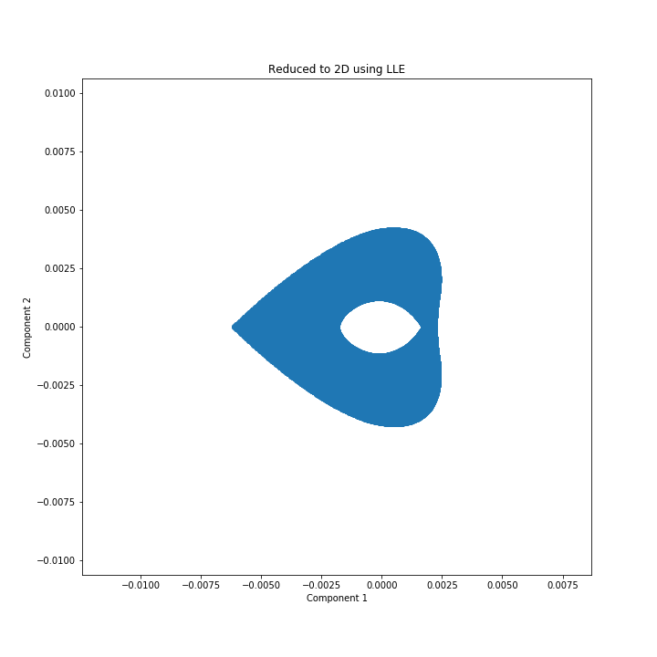
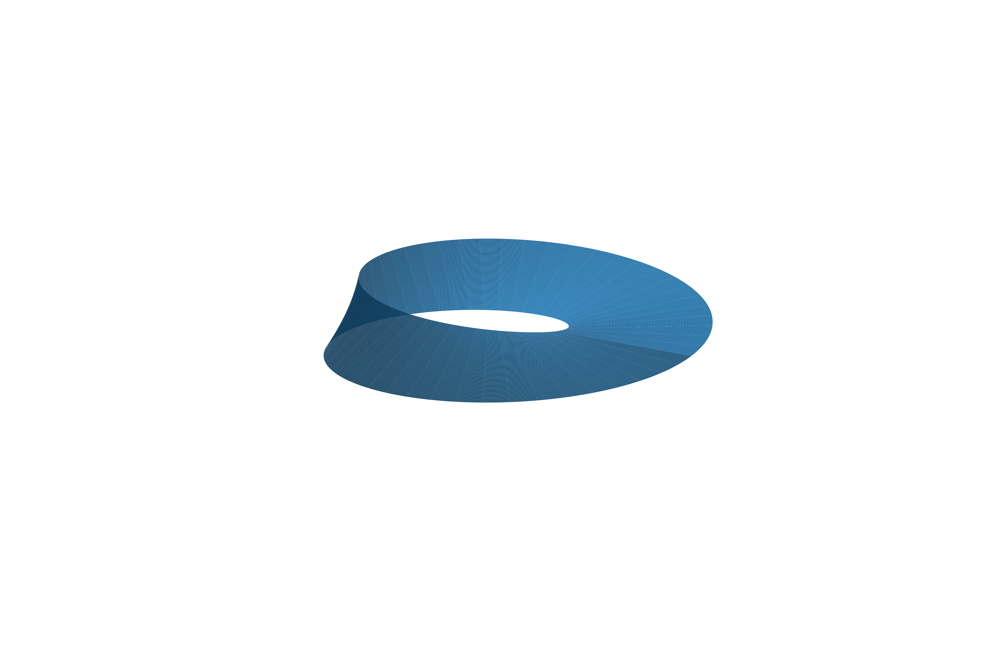
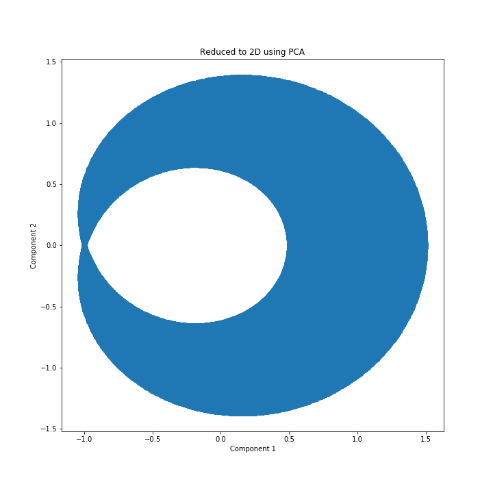

[](http://quantlet.de/)

## [](http://quantlet.de/) **LLE_moebius** [](http://quantlet.de/)

```yaml

Name of QuantLet:   LLE_moebius

Published in:       ''

Description:        'Plotting the Moebius band'

Keywords:
 - plot
 - LLE
 - Moebius
 - visualization
 - dimensionality reduction

Author:             Elizaveta Zinovyeva

Submitted:          Thu, March 19 2020 by Elizaveta Zinovyeva

Output:             'LLE_reduce.png, mobiusband.png, pca_reduce.png'

```







### [IPYNB Code: LLE_moebius.ipynb](LLE_moebius.ipynb)


automatically created on 2021-04-23